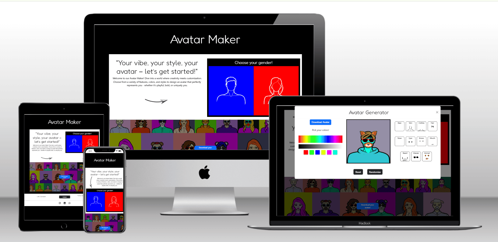

### Project 2

# Avatar Maker Website

[View project on GitHub](https://sara-sundin.github.io/SizeMeApp_avatarGame/).

## Introduction

Welcome to the Avatar Maker! This web application allows users to design personalized avatars with ease. Whether you're looking to create a playful, professional, or unique representation of yourself, the Avatar Maker provides a variety of customization options, including gender selection, facial features, colors, and accessories. With an intuitive interface and interactive tools, you can create and download your perfect avatar in just a few clicks. Perfect for profiles, games, or creative projects!

# CONTENT

[USER EXPERIENCE (UX)](#user-experience)
- My website across UX planes
- User Stories
 

[DESIGN](#design)
- Colour Scheme
- Typography
- Imagery
- Wire Frames
- Structure of the website
- Features
- Accessibility
- Aria labels
 

[TECHNOLOGIES USED](#technologies-used)
- Languages used to create the website
- Frameworks & Libraries
- Software
- Automated Tools
- ChatGPT
 

[DEPLOYMENT](#deployment)
- GitHub
 

[TESTING](#testing)
- Devices
- Browsers
- Testing Grid
- Chrome Dev Tools
- Lighthouse
- Validators
- Bugs & Fixes
 

[REFERENCES](#references)
- Media References
- Content References
 

[CREDITS](#credits)
- Images
- Code
 

[PERSONAL NOTES](#personal-notes)

[ACKNOWLEDGMENTS](#acknowledgments)

 
 

 
 

## My website across UX planes

### Strategy Plane
The primary goal of the website is to provide users with an engaging, interactive tool to create personalized avatars while showcasing my technical and creative abilities. The target audience includes casual users looking for a fun avatar generator, as well as potential collaborators or employers interested in my web development and design skills. The website meets user needs by offering a seamless avatar creation experience and a visually appealing, intuitive interface.

### Scope Plane
The website includes essential features like an avatar creation tool, gender selection, and customization options. Additional features, such as randomization and a download button for created avatars, enhance the experience. The design focuses on must-have functionality for accessibility and entertainment while offering optional features that make the process more enjoyable and engaging.

### Structure Plane
The website is structured to ensure ease of navigation and interaction:
- A welcoming homepage introduces the Avatar Maker with clear instructions.
- A gender selection section allows users to start their journey with tailored avatar options.
- Customization tools are presented logically, offering intuitive interaction.
- A download feature lets users save their creations effortlessly.
  
### Skeleton Plane
The layout is simple and user-friendly:
- Interactive elements like buttons, sliders, and thumbnails are placed where users naturally expect them.
- A responsive design ensures the website adapts seamlessly to mobile, tablet, and desktop devices.
- Clear labels and visual cues such as headings and tooltips guide users through the avatar creation process without confusion.
  
### Surface Plane
The visual design is playful and creative, reflecting the theme of personalization and self-expression:
- Bright, welcoming colors and clean typography set a friendly tone.
- Background images and avatar previews enhance visual appeal and interactivity.
- Hover effects, animations, and transparent overlays add subtle interactivity while maintaining focus on the core functionality.
- 

## User Stories
### First-Time Visitors
Goal: Quickly understand the purpose of the website and begin creating their avatar.
- See a welcoming homepage with a clear introduction and instructions (User Story 1).
- Learn about the Avatar Maker and its features through brief, engaging descriptions (User Story 2).
- Access the gender selection section to start creating their avatar (User Story 3).
- Experience seamless navigation across devices with responsive design (User Story 4).
- View samples of responsive avatars to get inspired and see the possibilities (User Story 9).
### Returning Visitors
Goal: Continue customizing or exploring new features.
- Revisit the Avatar Maker to experiment with different styles or features (User Story 5).
- Use the download feature to save their avatar for personal or professional use (User Story 6).
### Frequent Visitors
Goal: Engage with the website and share feedback.
- Explore updates or new features added to the Avatar Maker (User Story 7).
- Share the Avatar Maker with friends or colleagues using the site’s social sharing options (User Story 8).
- Provide feedback on their experience to contribute to future improvements (User Story 10).

<h4>User Story 1 (must-have)</h4>

  
### User Story 1 (must-have)
As a visitor, I want to see a welcoming homepage with a brief introduction,
so that I can quickly understand the purpose of the Avatar Maker site.

#### Acceptance Criteria
- A clear heading introduces the Avatar Maker.
- Brief text explains what the site does.
- Navigation links to the gender selection.
- 
#### Tasks
- Design a clean homepage layout.
- Add a prominent heading and introductory text.
- Implement responsive navigation links.

<h4>User Story 2 (must-have)</h4>

  
### User Story 2 (must-have)
As a visitor, I want to explore the features of the Avatar Maker,
so that I can understand what customizations are available.

#### Acceptance Criteria
- A section highlights the customization features (e.g., gender, clothing, accessories).
- Buttons or links guide users to start creating their avatar.
- Responsive design ensures usability on all devices.- 

#### Tasks
- Create a features section with descriptive icons or images.
- Add buttons to direct users to the customization interface.
- Test responsiveness across various screen sizes.

  

<h4>User Story 3 (must-have)</h4>

  
### User Story 3 (must-have)
As a visitor, I want to select a gender to begin my avatar creation,
so that I can personalize my experience.

#### Acceptance Criteria
- Male and female options are presented clearly.
- Clicking on an option opens the avatar editor.
- A modal or page transition confirms the selected option.

#### Tasks
- Design a visually appealing gender selection section.
- Implement clickable gender options linked to their respective modals or pages.
- Test functionality to ensure a seamless experience.

  

<h4>User Story 4 (must-have)</h4>

  
### User Story 4 (must-have)
As a visitor, I want the site to be responsive, so that I can navigate and use it across devices.

#### Acceptance Criteria
- The site layout adjusts seamlessly on mobile, tablet, and desktop screens.
- All interactive elements (e.g., buttons, modals) remain functional on touch devices.

#### Tasks
- Use a responsive grid system for layout design.
- Test the site’s usability across various devices and browsers.

  

<h4>User Story 5 (must-have)</h4>

### User Story 5 (could-have)
- As a returning visitor, I want to experiment with new styles and features, so that I can further customize my avatar.

#### Acceptance Criteria
- The customization interface offers a variety of options.
- New styles or features are clearly marked.
- Users can easily apply changes and see them reflected in real time.

#### Tasks
- Add diverse customization options for clothing, accessories, etc.
- Highlight new features with labels or icons.
- Ensure real-time updates on the avatar canvas.

 

<h4>User Story 6 (should-have)</h4>

  
### User Story 6 (should-have)
As a visitor, I want to download my avatar, so that I can save it for personal or professional use.

#### Acceptance Criteria
- A download button is prominently displayed in the editor or final screen.
- Clicking the button saves the avatar as a high-resolution image.

#### Tasks
- Implement a download feature that merges all avatar layers.
- Optimize the download button for both desktop and mobile.

 

<h4>User Story 7 (could-have)</h4>

  
### User Story 7 (could-have)
- As a frequent visitor, I want to provide feedback about the Avatar Maker, so that I can contribute to its improvement.

#### Acceptance Criteria
- A feedback form is easily accessible.
- Users can rate their experience and leave comments.
- A confirmation message is displayed after submission.

#### Tasks
- Design a feedback form with rating options and a text box.
- Add a backend to collect and store feedback data.
- Display a confirmation message or thank-you page.

 

<h4>User Story 8 (could-have)</h4>

  
#### User Story 8 (could-have)
As a frequent visitor, I want to share the Avatar Maker with others, so that my friends or colleagues can use it too.

#### Acceptance Criteria
- Social sharing buttons are prominently displayed.
- Users can share the site link via social media or email.

#### Tasks
- Add social media sharing buttons (e.g., Facebook, Twitter, LinkedIn).
- Test sharing functionality to ensure links work correctly.

 

<h4>User Story 9 (want-have)</h4>

  
### User Story 9 (want-have)
As a visitor, I want to view samples of responsive avatars, so that I can get inspired and see the possibilities before creating my own.

#### Acceptance Criteria
- A gallery section showcases a variety of pre-designed avatars.
- Clicking on a sample opens it in the editor for further customization.
- The gallery is visually appealing and easy to navigate.

#### Tasks
- Design a gallery layout with a grid or carousel of avatars.
- Link gallery items to the avatar editor with the preloaded design.
- Ensure the gallery is responsive and loads efficiently

 

<h4>User Story 10 (want-have)</h4>

  
### User Story 10 (want-have)
As a visitor, I want to provide feedback on my experience, so that I can contribute to improving the Avatar Maker site.

#### Acceptance Criteria
- A feedback form is accessible from the main navigation or footer.
- The form allows users to rate their experience and leave comments.
- A confirmation message is displayed after successful submission.

#### Tasks
- Design and implement a feedback form with fields for rating and comments.
- Add a "Submit Feedback" button that sends data to the server or stores it locally.
- Ensure the form is accessible and mobile-friendly.

 

[Back to Content Table](#content)

 
 

 
 

# DESIGN
- [Colour Scheme](#colour-scheme)
- [Typography](#typography)
- [Imagery](#imagery)
- [Wire Frames](#wire-frames)
- [Structure of the website](#structure-of-the-website)
- [Features](#features)
- [Accessibility](#accessibility)
- [Aria labels](#aria-labels-used)
- 
## Colour Scheme

 
 
The Avatar Maker website employs a vibrant and dynamic color scheme with bright red and blue accents set against a clean black-and-white foundation. Red is used to highlight actions, drawing attention and evoking a sense of energy and urgency, while blue provides a calming counterbalance, fostering trust, balance, and creativity. The deliberate use of these colors creates a striking visual hierarchy that guides users intuitively. The strong contrast ensures excellent accessibility, readability, and a visually engaging experience across devices.

## Typography
The chosen typography for my website are both Google fonts and combine Fredoka for headings and Lato for the main content. This pairing enhances the user experience by creating a playful and approachable aesthetic while maintaining excellent readability and a clean design throughout.

Fredoka: This rounded, bold typeface brings a sense of friendliness and vibrancy to the website. Its approachable design makes it perfect for attention-grabbing headings, aligning well with the creative and interactive theme of the site.

Lato: A modern sans-serif font with a humanist touch, Lato ensures clear readability for the main content. Its clean, neutral design complements the bold playfulness of Fredoka, providing a harmonious balance that enhances the overall user experience.
