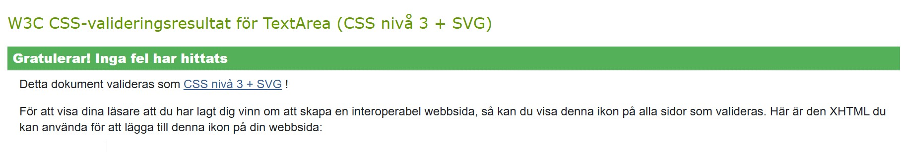

### Project 2

# Avatar Maker Website

[View project on GitHub](https://sara-sundin.github.io/SizeMeApp_avatarGame/).

## Introduction

Welcome to the Avatar Maker! This web application allows users to design personalized avatars with ease. Whether you're looking to create a playful, professional, or unique representation of yourself, the Avatar Maker provides a variety of customization options, including gender selection, facial features, colors, and accessories. With an intuitive interface and interactive tools, you can create and download your perfect avatar in just a few clicks. Perfect for profiles, games, or creative projects!

# CONTENT

[REPOSITORY OVERVIEW](#repository-overview)
- Project Structure & Explanation
 

[USER EXPERIENCE (UX)](#user-experience)
- The website across UX planes
- User Stories
- Accessibility
- Aria labels
 

[DESIGN](#design)
- Design Planning
- Colour Scheme
- Typography
- Imagery
- Wire Frames
- Structure of the website
- Features
 

[TECHNOLOGIES USED](#technologies-used)
- Languages used to create the website
- Frameworks & Libraries
- Software
- Automated Tools
- ChatGPT
 

[DEPLOYMENT](#deployment)
- GitHub
 

[TESTING](#testing)
- Devices
- Browsers
- Testing Grid
- Chrome Dev Tools
- Lighthouse
- Validators
- Bugs & Fixes
 

[REFERENCES](#references)
- Media References
- Content References
 

[CREDITS](#credits)
- Images
- Code
 

[PERSONAL NOTES](#personal-notes)

[ACKNOWLEDGMENTS](#acknowledgments)

 
 

 
 

# REPOSITORY OVERVIEW

## Project Structure & Explanation
I have included a diagram to provide a clear overview of the project's file structure, categorizing files based on their type and purpose. The project consists of HTML, CSS, and JavaScript files, along with automated tests written using Jest.

### HTML (Content)
index.html – The main entry point of the application, linking all necessary styles and scripts.

avatar-female.html & avatar-male.html – Separate pages for different avatar selections.

### CSS (Styling)
style.css – Main stylesheet for the project.

style-avatar.css – Specific styles for avatar-related pages.

### JavaScript (Functionality)
script.js – Primary script handling general interactions.

script-avatar.js – Control avatar-related interactions.  
(I originally had separate scripts for the two avatar modals (avatar-female.js & script-avatar-male.js). In my final mentor session for this project my mentor advised me to combine the two files due to repeating code. I then created a file with a function to select the avatar type depending on female or male modal.

script-contact.js – Manages the contact form and modal. I separated this since I tested this code with jest.

### Testing (Jest)
script-contact-test.js – Jest test suite ensuring that script-contact.js functions correctly.

<h4>Repository Overview</h4>

[Back to Content Table](#content)

- # USER EXPERIENCE
- [UX planes](#the-website-across-UX-planes)
- [User Stories](#user-stories)
- [Accessibility](#accessibility)
- [Aria labels](#aria-labels-used)

## The website across UX planes

### Strategy Plane
The primary goal of the website is to provide users with an engaging, interactive tool to create personalized avatars while showcasing my technical and creative abilities. The target audience includes casual users looking for a fun avatar generator, as well as potential collaborators or employers interested in my web development and design skills. The website meets user needs by offering a seamless avatar creation experience and a visually appealing, intuitive interface.

### Scope Plane
The website includes essential features like an avatar creation tool, gender selection, and customization options. Additional features, such as randomization and a download button for created avatars, enhance the experience. The design focuses on must-have functionality for accessibility and entertainment while offering optional features that make the process more enjoyable and engaging.

### Structure Plane
The website is structured to ensure ease of navigation and interaction:
- A welcoming homepage introduces the Avatar Maker with clear instructions.
- A gender selection section allows users to start their journey with tailored avatar options.
- Customization tools are presented logically, offering intuitive interaction.
- A download feature lets users save their creations effortlessly.
  
### Skeleton Plane
The layout is simple and user-friendly:
- Interactive elements like buttons, sliders, and thumbnails are placed where users naturally expect them.
- A responsive design ensures the website adapts seamlessly to mobile, tablet, and desktop devices.
- Clear labels and visual cues guide users through the avatar creation process without confusion.
  
### Surface Plane
The visual design is playful and creative, reflecting the theme of personalization and self-expression:
- Bright, welcoming colors and clean typography set a friendly tone.
- Background images and avatar previews enhance visual appeal and interactivity.
- Hover effects, animations, and transparent overlays add subtle interactivity while maintaining focus on the core functionality.

## User Stories
### First-Time Visitors
Goal: Quickly understand the purpose of the website and begin creating their avatar.
- See a welcoming homepage with a clear introduction and instructions (User Story 1).
- Learn about the Avatar Maker and its features through brief, engaging descriptions (User Story 2).
- Access the gender selection section to start creating their avatar (User Story 3).
- Experience seamless navigation across devices with responsive design (User Story 4).
- View samples of responsive avatars to get inspired and see the possibilities (User Story 9).
### Returning Visitors
Goal: Continue customizing or exploring new features.
- Revisit the Avatar Maker to experiment with different styles or features (User Story 5).
- Use the download feature to save their avatar for personal or professional use (User Story 6).
### Frequent Visitors
Goal: Engage with the website and share feedback.
- Share the Avatar Maker with friends or colleagues using the site’s social sharing options (User Story 7).
- Provide feedback on their experience to contribute to future improvements (User Story 8).

<h4>User Story 1 (must-have)</h4>

  
### User Story 1 (must-have)
As a visitor, I want to see a welcoming homepage with a brief introduction,
so that I can quickly understand the purpose of the Avatar Maker site.

#### Acceptance Criteria
- A clear heading introduces the Avatar Maker.
- Brief text explains what the site does.
- Navigation links to the gender selection.
- 
#### Tasks
- Design a clean homepage layout.
- Add a prominent heading and introductory text.
- Implement responsive navigation links.

<h4>User Story 2 (must-have)</h4>

  
### User Story 2 (must-have)
As a visitor, I want to explore the features of the Avatar Maker,
so that I can understand what customizations are available.

#### Acceptance Criteria
- A section highlights the customization features (e.g., gender, clothing, accessories).
- Buttons or links guide users to start creating their avatar.
- Responsive design ensures usability on all devices.- 

#### Tasks
- Create a features section with descriptive icons or images.
- Add buttons to direct users to the customization interface.
- Test responsiveness across various screen sizes.

  

<h4>User Story 3 (must-have)</h4>

  
### User Story 3 (must-have)
As a visitor, I want to select a gender to begin my avatar creation,
so that I can personalize my experience.

#### Acceptance Criteria
- Male and female options are presented clearly.
- Clicking on an option opens the avatar editor.
- A modal or page transition confirms the selected option.

#### Tasks
- Design a visually appealing gender selection section.
- Implement clickable gender options linked to their respective modals or pages.
- Test functionality to ensure a seamless experience.

  

<h4>User Story 4 (must-have)</h4>

  
### User Story 4 (must-have)
As a visitor, I want the site to be responsive, so that I can navigate and use it across devices.

#### Acceptance Criteria
- The site layout adjusts seamlessly on mobile, tablet, and desktop screens.
- All interactive elements (e.g., buttons, modals) remain functional on touch devices.

#### Tasks
- Use a responsive grid system for layout design.
- Test the site’s usability across various devices and browsers.

  

<h4>User Story 5 (must-have)</h4>

### User Story 5 (could-have)
- As a returning visitor, I want to experiment with new styles and features, so that I can further customize my avatar.

#### Acceptance Criteria
- The customization interface offers a variety of options.
- New styles or features are clearly marked.
- Users can easily apply changes and see them reflected in real time.

#### Tasks
- Add diverse customization options for clothing, accessories, etc.
- Highlight new features with labels or icons.
- Ensure real-time updates on the avatar canvas.

 

<h4>User Story 6 (should-have)</h4>

  
### User Story 6 (should-have)
As a visitor, I want to download my avatar, so that I can save it for personal or professional use.

#### Acceptance Criteria
- A download button is prominently displayed in the editor or final screen.
- Clicking the button saves the avatar as a high-resolution image.

#### Tasks
- Implement a download feature that merges all avatar layers.
- Optimize the download button for both desktop and mobile.

 

<h4>User Story 7 (could-have)</h4>

  
### User Story 7 (could-have)
- As a frequent visitor, I want to provide feedback about the Avatar Maker, so that I can contribute to its improvement.

#### Acceptance Criteria
- A feedback form is easily accessible.
- Users can rate their experience and leave comments.
- A confirmation message is displayed after submission.

#### Tasks
- Design a feedback form with rating options and a text box.
- Add a backend to collect and store feedback data.
- Display a confirmation message or thank-you page.

 

<h4>User Story 8 (could-have)</h4>

  
#### User Story 8 (could-have)
As a frequent visitor, I want to share the Avatar Maker with others, so that my friends or colleagues can use it too.

#### Acceptance Criteria
- Social sharing buttons are prominently displayed.
- Users can share the site link via social media or email.

#### Tasks
- Add social media sharing buttons (e.g., Facebook, Twitter, LinkedIn).
- Test sharing functionality to ensure links work correctly.

 

<h4>User Story 9 (want-have)</h4>

  
### User Story 9 (want-have)
As a visitor, I want to view samples of responsive avatars, so that I can get inspired and see the possibilities before creating my own.

#### Acceptance Criteria
- A gallery section showcases a variety of pre-designed avatars.
- Clicking on a sample opens it in the editor for further customization.
- The gallery is visually appealing and easy to navigate.

#### Tasks
- Design a gallery layout with a grid or carousel of avatars.
- Link gallery items to the avatar editor with the preloaded design.
- Ensure the gallery is responsive and loads efficiently

 

[Back to Content Table](#content)

## Accessibility
The following measures has been taken to make sure the website is accessible.
- Semantic Elements: Elements like header, main, and footer are used to provide clear structure, making it easier for screen readers to interpret content.
- Descriptive Headings: Properly structured heading levels (e.g., h1, h2, h3) to create a logical document outline.
- Alt Attributes: Every image includes meaningful alt text, ensuring visually impaired users understand the content.
- Focusable Elements: Navigation links, buttons, and forms are fully accessible using only the keyboard (e.g., via tab and enter keys).
- High Contrast: Text and background colors are chosen to meet the standards.
- Flexible Layouts: The website is fully responsive, ensuring accessibility across various devices, including desktops, tablets, and smartphones.
- Viewport Meta Tag: Ensures proper scaling and readability on mobile devices.
- Labels for Form Fields: All form fields include <label> tags or appropriate aria-label attributes to guide users through form completion.
- ARIA labels: Aria roles are added where necessary to define regions of the page for assistive technologies.
- Readable Fonts: Fonts like "Lato" are legible with sufficient size and line spacing for comfortable reading.
- Scalable Text: Text can be resized without loss of content or functionality.
- Accessibility Testing Tools: Lighthouse has been used to identify and address accessibility issues.

## ARIA Labels Used

### Female Modal
- aria-labelledby="femaleModalLabel"
- aria-hidden="true"

### Male Modal
- aria-labelledby="maleModalLabel"
 aria-hidden="true"

### Close Button (Female Modal & Male Modal)
- aria-label="Close"

### Social Media Links
- Instagram: aria-label="Visit my Instagram page (opens in a new tab)"
- LinkedIn: aria-label="Visit my LinkedIn page (opens in a new tab)"
- WhatsApp: aria-label="Connect on Whatsapp (opens in a new tab)"

[Back to Content Table](#content)

 
 

 
 

# DESIGN
- [Design Planning](#design-planning)
- [Colour Scheme](#colour-scheme)
- [Typography](#typography)
- [Imagery](#imagery)
- [Wire Frames](#wire-frames)
- [Structure of the website](#structure-of-the-website)
- [Features](#features)

## Design Planning
The original concept for the website was more extensive than the final outcome, the avatar maker was first intended to be a part of a larger flow from registration as a user for another application. This diagram represents the initial planning and user flow for the website, designed to create a personalized user experience by incorporating body type selection, user preferences, and avatar customization. The diagram illustrates the planning of the journey and serves as a reference for future improvements and expansion.

<h4>Design Planning Diagram</h4>

  
## Colour Scheme

 
 
The Avatar Maker website employs a vibrant and dynamic color scheme with bright red and blue accents set against a clean black-and-white foundation. Red is used to highlight actions, drawing attention and evoking a sense of energy and urgency, while blue provides a calming counterbalance, fostering trust, balance, and creativity. The deliberate use of these colors creates a striking visual hierarchy that guides users intuitively. The strong contrast ensures excellent accessibility, readability, and a visually engaging experience across devices.

## Typography
The chosen typography for my website are both Google fonts and combine Fredoka for headings and Lato for the main content. This pairing enhances the user experience by creating a playful and approachable aesthetic while maintaining excellent readability and a clean design throughout.

Fredoka: This rounded, bold typeface brings a sense of friendliness and vibrancy to the website. Its approachable design makes it perfect for attention-grabbing headings, aligning well with the creative and interactive theme of the site.

Lato: A modern sans-serif font with a humanist touch, Lato ensures clear readability for the main content. Its clean, neutral design complements the bold playfulness of Fredoka, providing a harmonious balance that enhances the overall user experience.

## Imagery
The images used in this site are created by myself as sketches in Adobe Illustrator. The collage of avatars was created by inviting friends and peers to design their own avatars, which were then collected and curated into a dynamic composition that celebrates creativity and individuality.

## Wire Frames
The wireframes were created in Adobe Illustrator for mobile, tablet and desktop. I have developed and used my own toolkit for the wireframes. The outcome for the website looks slightly different than the initial wireframes but the introduction of the page remained consistent.

<h4>Page Wireframe</h4>

## Features

### Animation Intro
When accessing the website an animation intro displaying Ready.. Set.. Create! One word showing at a time with the word expanding at the end of each display. The intro becomes hidden and the main page displays.

<h4>Animation Intro</h4>
>

#### Favicon
The website includes a custom favicon to enhance its identity and improve user experience. The favicon, a small yet recognizable icon displayed in the browser tab, represents the creative and interactive nature of the Avatar Maker.

I designed the favicon in Adobe Illustrator, featuring a simplified avatar icon to match the site’s overall aesthetic. Its vibrant colors and clean lines ensure visibility and clarity, even at small sizes. This attention to detail reinforces the website's branding and provides users with a polished, professional experience.

<h4>Favicon Image</h4>
>

### Header

<h4>Header Image - Desktop</h4>
>

#### Introduction Section
The Avatar Maker website welcomes users with an engaging and user-friendly introduction. The homepage features a bold heading, "Your vibe, your style, your avatar – let’s get started!", which sets the tone for creativity and individuality. A brief introductory paragraph invites users to explore the avatar customization journey with an arrow pointing to the images where the avatar generator opens, highlighting the fun and versatility of the tool.

<h4>Introduction Section Image - Desktop</h4>
>

#### Choose Gender Section
The Choose-Gender section invites users to begin their avatar creation journey with a choice between male and female avatars. Featuring clear, clickable icons and hover animations, the images respond dynamically, enhancing the experience and making it clear what to do. This responsive feedback captures attention and ensures seamless navigation. Each selection opens a modal for customization, making the transition smooth and intuitive. Designed for accessibility, this section is engaging and inclusive across all devices.

<h4>Choose Gender Section Image - Desktop</h4>
>

#### Avatar Generator Modal
The Avatar Generator Modal is a central feature of the site, designed to provide users with an engaging and interactive experience. When triggered, the modal opens to reveal the Avatar Maker interface, where users can customize their avatars with ease. This full-screen design ensures focus on the creative process, eliminating distractions. With intuitive controls and seamless transitions, users can select features, adjust colors, and preview their avatars in real time. The modal's clean layout and responsive design enhance usability across devices, ensuring accessibility for all users.

<h4>Female Modal Image - Desktop</h4>
>

<h4>Female Modal Image - Desktop</h4>
>

#### Avatar Collage Section
The Avatar Collage section showcases a vibrant collection of avatars designed by users, serving as both an inspiring visual element and a navigation feature. At the center of the collage, a prominent button labeled "Download your avatar!" captures attention and provides guidance. This button links users back to the start of the introduction, ensuring a seamless flow through the site. 

<h4>Avatar Collage Section Image - Desktop</h4>
>

#### Contact Section
The Contact Section offers an intuitive way for users to connect. At its heart is a prominently displayed button that, when clicked, opens a modal containing a clean and user-friendly email form. This design ensures seamless communication by allowing users to send inquiries or feedback directly without navigating away from the page. The straightforward functionality and modern design make it easy for users to engage, reinforcing accessibility and creating a streamlined user experience.

<h4>Contact Section Image - Desktop</h4>
>

#### Contact Modal
The contact modal is displaying a clean and simple form for submitting inquiries or feedback. The form includes fields for name, email, and message, ensuring all necessary details are collected efficiently. Designed for ease of use, the modal keeps the user on the page without the need for redirection.

<h4>Contact Modal Image - Desktop</h4>
>

#### Success Modal
The Success Modal Window provides users with immediate feedback after successfully submitting the contact form. Once the "Send" button is pressed, the contact modal gracefully closes, and a success modal appears, confirming that the message has been sent. This modal includes a brief thank-you message to acknowledge the user's effort and reassure them that their inquiry has been received.

<h4>Success Modal Image - Desktop</h4>
>

#### Footer
The Footer serves as a compact and functional closing section of the website, providing essential information and quick access to external links. It includes prominent social media icons, enabling users to easily connect on platforms like Instagram, LinkedIn, and WhatsApp. The footer's minimalist design aligns with the overall aesthetic of the site, ensuring it complements rather than distracts. The three social media icons are added with Font Awesome.

<h4>Footer Image - Desktop</h4>
>

#### Future Pages - Avatar Inspiration Gallery
A planned addition to the website is an Avatar Inspiration Gallery, designed to inspire users and showcase the creative possibilities of the Avatar Maker. This feature will display a visually appealing grid or carousel of pre-designed avatars, each tailored to highlight unique styles and combinations. Users can browse the gallery and click on a sample to load it directly into the avatar editor for further customization. The responsive design will ensure seamless accessibility across all devices, enhancing the user experience. This gallery will serve as both an inspiration hub and a practical starting point for creating personalized avatars.

 
 

 
 

# TECHNOLOGIES USED
- [Languages used to create the website](#languages-used-to-create-the-website)
- [Frameworks & Libraries](#frameworks-and-libraries)
- [Software](#software)
- [Automated Tools](#automated-tools)
- [ChatGPT](#chatgpt)
- [Jest](#jest)
  
## Languages Used to Create the Website
- HTML
- CSS
- JavaScript
  
## Frameworks and Libraries
- Bootstrap (for responsive design and styling).
- Font Awesome (for icons).
- Google Fonts (for typography).
- Iloveimg.com (to compress images for faster loading).
- Jest (for testing javascript).
  
## Software
- Adobe Illustrator (for wireframes and hero image creation).
- Adobe Photoshop (for image editing and optimization).
- Git (for version control).
- GitHub (to save and store the website's code and files).
  
## Automated Tools
- Chrome DevTools (for debugging and testing).
- Lighthouse (to analyze performance, accessibility, and SEO).
- W3C HTML & CSS Validator (to validate and check the html and css).
- JSHint (to validate and check the javascript code).
- Techsini.com (for multidevice image and testing responsiveness).

## Jest
I used Jest to test the javascript code for the contact modal. Due to this I separated the javascript code for the contact modal in the repository.

[Back to Content Table](#content)

 
 

 
 

# DEPLOYMENT

## Ensure your website files (HTML, CSS, JavaScript, etc.) are committed to a GitHub repository.
- Go to Repository Settings
- Navigate to the repository on GitHub.
- Click on the Settings tab.
- Enable GitHub Pages
- Scroll down to the Pages section.
- Under "Branch," select the branch you want to deploy (typically main or master).
- Click Save.

## Access Your Website
After a few moments, GitHub Pages will generate a URL for your site (e.g., https://username.github.io/repository-name).
Visit this URL to view your deployed website.

<h4>GitHub Deployment Page</h4>

[Back to Content Table](#content)

 
 

 
 

# TESTING
- [Devices](#devices)
- [Browsers](#browsers)
- [Testing Grid](#testing-grid)
- [Chrome Dev Tools](#chrome-dev-tools)
- [Lighthouse](#lighthouse)
- [Validation](#validation)
- [Bugs & Fixes](#bugs-and-fixes)
  
## Devices

### The testing on the site has been made on four different devices:
Samsung Galaxy Mobile A25  
Apple IPad Mini  
Apple IPad   
Lenovo Desktop 15"

## Browsers
### The different browsers used for testing:
Google Chrome  
Microsoft Edge  
Safari  
Firefox  
Samsung Internet

## Testing grid
I have used a grid for testing all components of the website. After testing I have fixed any issues arising and put a note in the grid what has been done. See below dropdown menu for the grid that I created in an excel spreadsheet using a free template as base. [Link to excel spreadsheet](assets/docs/test_checklist_project-2.xlsx)

<h3>Testing Grid</h3>

## Chrome Dev Tools
I have used Chrome Dev Tools throughout the development of the website to test for responsiveness and troubleshooting.

## Lighthouse
I used Chrome Dev Tools Lightouse to help improve the website's performance, accessibility, SEO, and user experience. The first time I ran the testing I received messages for improvement that I have recorded below. The Lighthouse tool provided actionable insights to optimize speed and fix issues. For the second run with Lighthouse I disabled the intro animation since it disturbed the accessability in terms of the color choices on the third word in the animation (Create!). I did not want to change the color since it was obvious it would not interfere with the overall user experience. After fixing the issues recorded below  all areas turned green and I received a score of 100 for all categories accompanied with a firework animation on the page.

<h4>1st run with Lighthouse</h4>

Improvement messages: 
- Organise the headings for better accessability.
- The word Create! in the animation intro do not have enough contrast.
- Missing meta tag for description.
  

<h4>2nd run with Lighthouse - after fixing the issues</h4>

## Validation
The HTML, CSS and Javascript code has been validated on below editors. The issues arising has been recorded in the dropdown menus.

### W3C HTML Validator
I have included screenprints of the first and final validation of the HTML with W3C validation.
 

<h4>Index Page HTML- Initial Check </h4>

- space on text for image favicon - removed 
- missing heading for gallery section - added.

<h4>Index Page HTML- Final Check </h4>

<h4>Female Avatar Modal HTML- Initial Check </h4>

- misuse of aria-label - removed. 
- backlash on open tags - removed.

<h4>Female Avatar Modal HTML- Final Check </h4>

<h4>Male Avatar Modal HTML- Initial Check (no fixes) </h4>

### W3C CSS Validator
The CSS was succesfully validated for all pages.

### JSHint Validator
I have included screenprints of the first and final validation for each script validated with JSHint.

<h4>Index Page Script- Initial Check </h4>

- use  esversion: 6 - included /* jshint esversion: 6 */ to enforce ES6 syntax in JSHint. 
- undefined variable (anime) - included /* global anime */ due to (anime) defined in html head script.

<h4>Index Page Script- Final Check </h4>

<h4>Female Avatar Modal Script- Initial Check </h4>

- loop should be wrapped in if statement - fixed. 
- use dont notation instead of brackets for "animal" and "nose" - fixed. 
- unused variable - defined.

<h4>Female Avatar Modal Script- Final Check </h4>

<h4>Male Avatar Modal Script- Initial Check </h4>

- loop should be wrapped in if statement - fixed. 

<h4>Male Avatar Modal Script- Final Check </h4>

<h4>Contact Modal Script- Initial Check </h4>

- loop should be wrapped in if statement - fixed. 

<h4>Contact Modal Script- Final Check </h4>

## Bugs and Fixes
Here I have recorded some issues that I spent excessive time solving with the solutions indicated below.

### Media Queirys Avatar Modals
The media queirys for the male and female modals did not work. I noticed the media queiry for 768px and up was applied to the modals instead of the intended media queiry for 1024px. Due to this I first applied the media queirys I wanted for the larger screen to the medium size screen.

#### Solution
After removing below css from the iframe the media queiry returned back to normal. 
 .responsive-iframe-container iframe { 
    width: 120%; 
    height: 130%; 
    border: 0; 
    transform: scale(0.7); 
    /* Scale down to 80% of the original size */ 
    transform-origin: top left; 
    /* Scale from the top-left corner */ 
}

### Swatches Color Picker
The swatches in the color picker did not work when picking the colors.

#### Solution
Since I had hex colors indicated in the swatches for the color picker they did not work due to the color-picker being set up as rgb. When adding the HexToRgb as the code in the dropdown menu the swatches became active.

<h4>Code for HEX swatches</h4>

### Bootstrap Blocking Modal Accessibility
When opening the avatar modals, the framework automatically sets aria-hidden="true" on the modal container. This prevents assistive technologies from recognizing the modal content. The browser blocks this behavior, leading to the following console warning:

<h4>Console Warning aria-hiddens</h4>

#### Solution
I tried to changing to the inert attribute instead, but still got the warning. I even removed all the bootstrap from the modal, using only css but still got the warning. In the final solution I implemented a JavaScript fix to override Bootstrap’s aria-hidden behavior and ensure accessibility compliance.
- On show.bs.modal: Removes aria-hidden and inert to make the modal accessible.
- On shown.bs.modal: Moves focus to the first interactive element inside the modal.
- On hide.bs.modal: Restores aria-hidden="true" and inert when closing.

<h4>Javascript Solution Console Warning</h4>

### Handling Multiple Canvases
The canvas did not draw for several reasons during the development.

#### Solution
I spent a lot of my time debugging why the canvas did not draw after adding another function or changing something in the css. Mostly the main thumbnails and the additional thumbnail functions were conflicting with each other. After a while I realised that if I changed something in the handleThumbnailSelection function I also needed to implement updates for the setupAdditionalThumbnails function. Since most of the functions in my scripts for the avatar generators are related to the canvas I had to investigate and see the script as a whole.

[Back to Content Table](#content)

 
 

 
 

# REFERENCES
- [Media References](#media-references)
- [Content References](#content-references)

## Media References
https://www.youtube.com/watch?v=xwKbtUP87Dk 
https://www.youtube.com/watch?v=W6NZfCO5SIk 
https://www.youtube.com/watch?v=PkZNo7MFNFg 
https://www.w3schools.com/html/html5_canvas.asp 
- Slack Community and information
- Stand Ups with Kay on Thursdays

## Content References
- Free Download Template for website checking from https://www.hubspot.com
- Code Institute Tutorials and Learning Content

[Back to Content Table](#content)

 
 

 
 

# CREDITS
- [Images](#images)
- [Code](#code)

## Images
All images are created by myself in Adobe Illustrator.

## Code

### Animation Intro
I have borrowed the javascript for the animation intro at the start of the page from a designer called Tobias Ahlin. You can find his work at https://tobiasahlin.com. I modified the code by changing the letters and colors of the text to implement my own design.

### ChatGPT
I have used ChatGPT throughout the process as a sparring partner for ideas, troubleshooting, and problem-solving. I have asked ChatGPT on solutions with the HTML, styling CSS and solutions for Javascript that I have followed in either writing or copied snippets of code into the IDE.

 
 

 
 

# PERSONAL NOTES
This project was a fun yet challenging deep dive into canvas-based rendering, allowing users to customize avatars by layering different facial features, clothing, and accessories. My goal was to create an intuitive, interactive experience with a clean UI and smooth interactions.  While there’s always room for improvement, I’m happy with what I was able to accomplish.

Throughout this process, I not only came to understand event-driven JavaScript but also refined my experience with HTML, CSS, and Chrome Developer Tools. There were moments when I genuinely doubted I would be able to finish due to JavaScript syntax. But working through those challenges made the process all the more rewarding.

One personal touch I added was the red and blue color scheme on the website's shape selection, a subtle reference to the red and blue pill scene in The Matrix. For me, this is a reminder that growth comes from embracing challenges, even when they feel daunting.

# ACKNOWLEDGMENTS
I want to thank my mentor Rory Patrick for always being so supporting and engaging in showing me new tips and tricks. Also a big thank you to the Slack community at Code Institute and the peers who are always eager to help out.

[Back to Content Table](#content)

 
 

 
 
